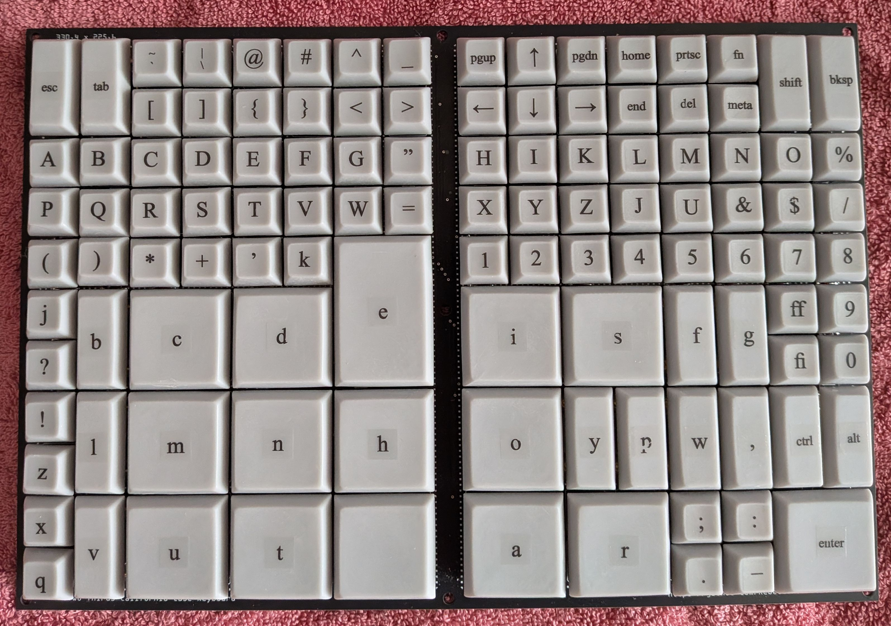

# Two Thirds California Case Keyboard

Inspired by [Attoparsec](https://www.youtube.com/@Attoparsec)'s [Two Thirds Keyboard](https://www.youtube.com/watch?v=vdP_sTMOWYo), I made my own with a few more symbols and function keys.

## Stuff to Get
* 159x Cherry MX compatible keyswitches
  * 99x for 1x1u and 1x2u keys (1x per key)
  * 60x for 2x2u and 2x3u keys (4x per key)
  * (I used Cherry MX Blue keyswitches but I recommend something much lighter for the 2x2u and 2x3u keys.)
* 114x through-hole 1N4148 diodes
* 15x Cherry MX compatible 2u stabilizers
* 2x through-hole 14-pin 2.54mm-spacing male header
* 1x Teensy 4.0 microcontroller
* 1x microUSB cable

## Stuff to Make
* 1x TTCC keyboard PCB, made from Gerber files in the `gerber` directory
* 84x 1x1u DSA profile keycaps
  * 26 capital letters: A B C D E F G H I J K L M N O P Q R S T U V W X Y Z
  * 5 small letters: j k q x z
  * 2 ligatures: ff fi
  * 10 digits: 1 2 3 4 5 6 7 8 9 0
  * 27 symbols: ! " # $ % & ' ( ) * + - . / : ; < = > ? @ [ ] ^ _ { }
  * 1 dual symbol: ~ `
  * 1 dual symbol: | \
  * 4 arrow keys
  * 6 function keys: page up, page down, home, end, prtsc, del
  * 2 modifier keys: fn, meta
* 15x 1x2u DSA profile keycaps
  * 8 small letters: b f g l p v w y
  * 1 symbol: ,
  * 3 function keys: escape, tab, backspace
  * 3 modifier keys: shift, ctrl, alt
* 14x 2x2u DSA profile keycaps
  * 12 small letters: a c d h i m n o r s t u
  * 1 enter key
  * 1 space key
* 1x 2x3u DSA profile keycap
  * 1 small letter: e
* A case of some sort (TBD)

## Stuff to Do
* Program the Teensy 4.0 microcontroller with the Arduino sketch in the `Arduino/ttcc` directory
* Solder in the diodes on the keyboard PCB
* Solder the Teensy 4.0 microcontroller to the keyboard PCB **on the opposite side**
* Insert the keyswitches into the keyboard PCB
* Double check with a multimeter that all the keyswitches work!
* Only **after** checking the keyswitches solder them to the PCB!
* Insert the stabilizers into the keyboard PCB
  * Sand the edges if necessary to prevent the PCB from bending
* Install the keycaps
* Check that the keyboard works
* Assemble the keyboard case
